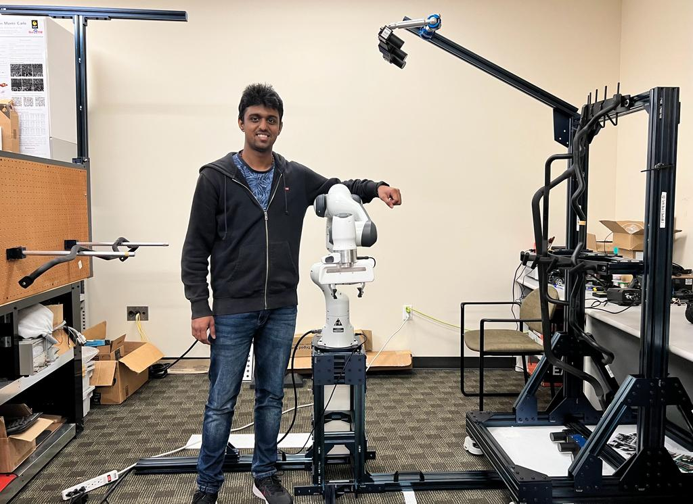
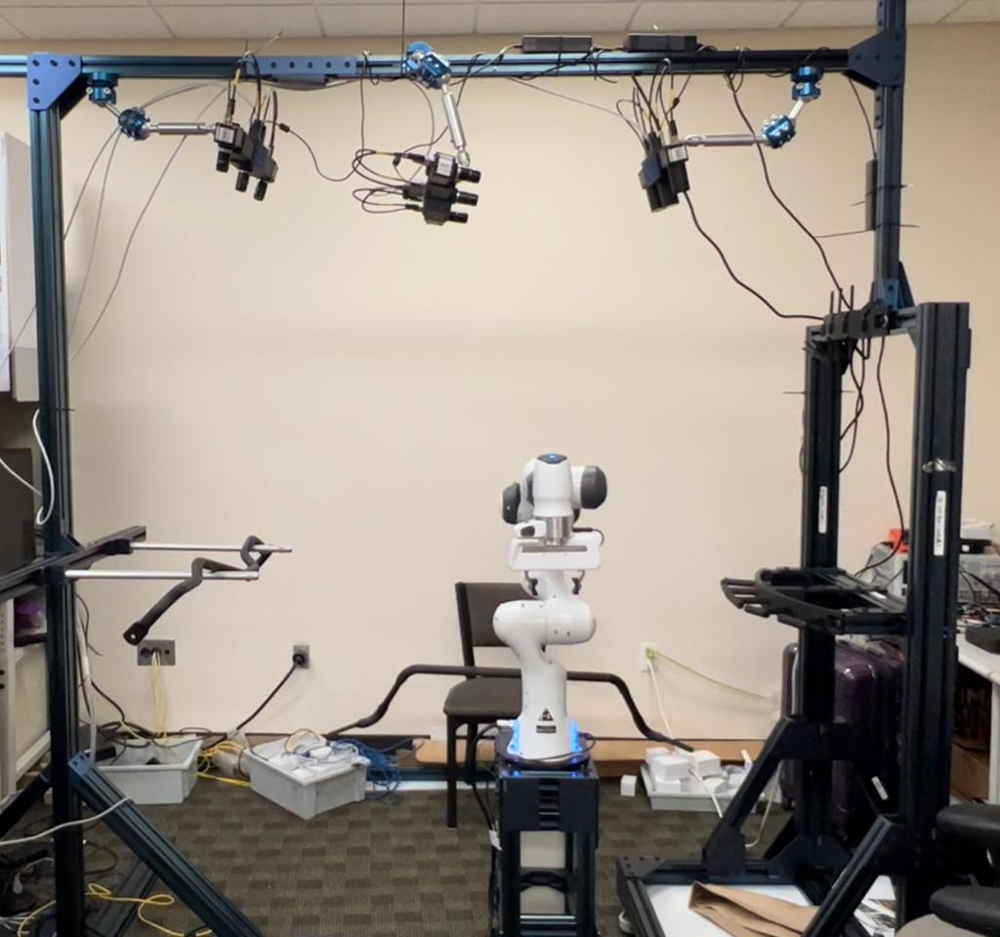
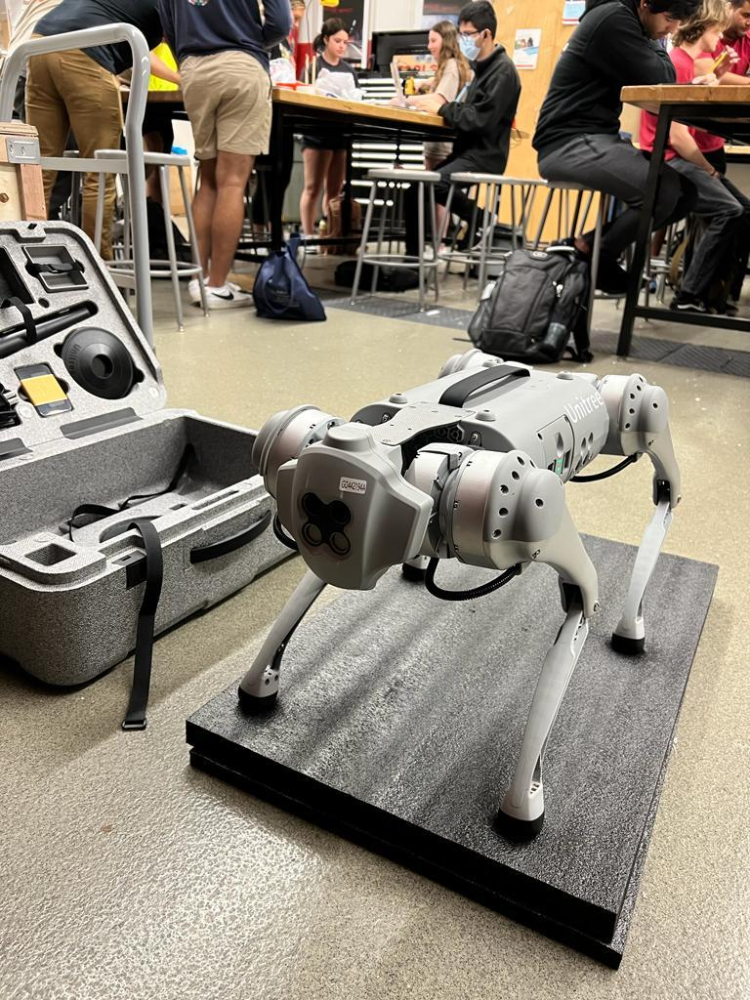
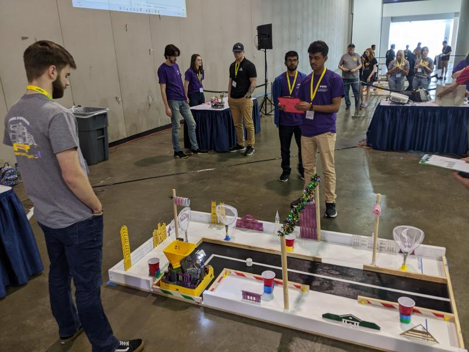
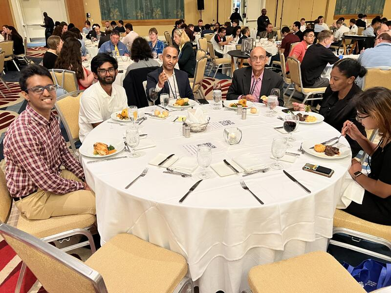

### Graduate Research Assistant - University of Central Florida
Worked on Industrial Automation as a part of my research assistantship at UCF. 

Initial Setup            |  Final Setup
:-----------------------------------:|:-------------------------:
 |  

- Role - Industrial Robotic Automation for Shot Peening Process
  - Setup a manufacturing environment within the lab using Vention iron Extrusions.
  - Extensively worked on the Industrial grade Franka Robot for the Pick N Drop of the Automotive Stab Bars.
  - Calibrated the depth cameras for enhanced visibility of the components in the Environment.
  - Designed an application for visualizing the estimated spline and the eye point of the StabBar using High Dimensional data.
  - Enhanced the dismantling and relocation process using detailed labelling of structure components and thorough documentation.

- Role - Data Incompleteness aspect of MRI 
  - Exploring the data incompleteness aspect of MRI images 
  - Performed Under sampling detection in the MRI Images using the Line detection algorithm
  - Performed motion analysis on the motion artefact contained MRI Images using Radon transform
  - I'm currently working towards a publication on the same.
 
### Graduate Teaching Assistant - University of Central Florida
Serving as a GTA for a undergraduate course "Introduction to Robotic's" at Computer Engineering and Electrical department

- Role
  - My tasks involve conducting lab sessions for Undergrad students in ROS. 
  - Managing a total of 60 students in total both online and offline. 
  - Assisting students with python and Linux.
  - Delivering presentations to students for effective understanding. 
  - Established a lab infrastructure for conducting robotic experiments with ROS and Ubuntu.     Delivered presentations on robotic simulation, aiding a class of 60 students in their assignments. Gave a guest lecture showcasing the Unitree Quadruped robot's functionality and advanced features.
  - Utilized AWS cloud infrastructure to create online lab environments using Robomaker and meticulously documented the entire workflow. 

- Achievements:
  - Received appreciation for quickly adapting to the newly given position as a
GTA and helping the students in the lab in an effective manner
  - Received recommendation from the Professors and Department of Electrical  to continue as a GTA for the rest of semester until the completion of my Masters program (2023). 

### Active member of IEEE SouthEast
Active member and a participant of IEEE since August 2021

Hardware Competition 2022            |  IEEE SouthEastCon 2023
:-----------------------------------:|:-------------------------:
 |  

- Role
  - Attended various workshops conducted my IEEE on various topics of AI.
  - Volunteered actively for both the SouthEast Conferences held in Orlando and alabama as Software and hardware competition organizer. 

 
